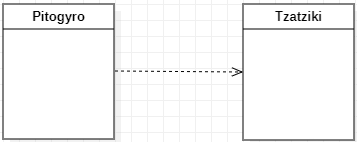

# Introduction to UML Class Diagrams
### Association

```
class Patates {
	// fried
};

class Pitogyro {
	Patates p1;
	// more attributes
};

```cpp


<br>
<br>

### Dependency

```cpp
class Tzatziki {
private:	
	int garlic;
	// more attributes

public:
	int reveal_garlic_level() {
		return garlic;
	}
	// more methods
};

class Pitogyro {

private:
	// attributes

public:
	bool spicy_level(Tzatziki h) {
		
		bool result = false;
		
		if (h.reveal_garlic_level() > 3) {
			return true;
		}
		
		return result;
	}
};
```


