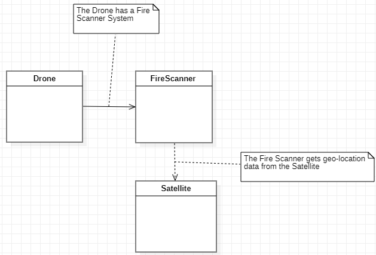

# Code Task Area

- [ ] Read carefully the Class Diagram that was given to you by the Designer/Requirements Department.
- [ ] Write the source code that implements the diagram.
- [ ] Fork the repo, add here the file with your code, and send a pull request!
- [ ] The file should include your IDs in the comments.

